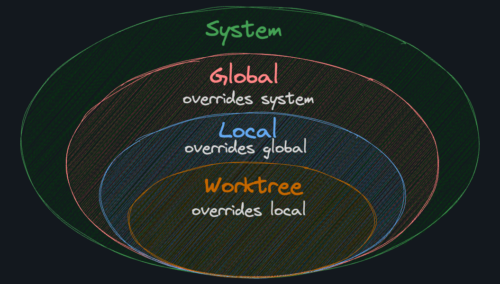
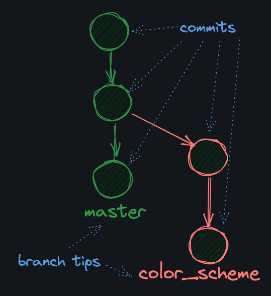
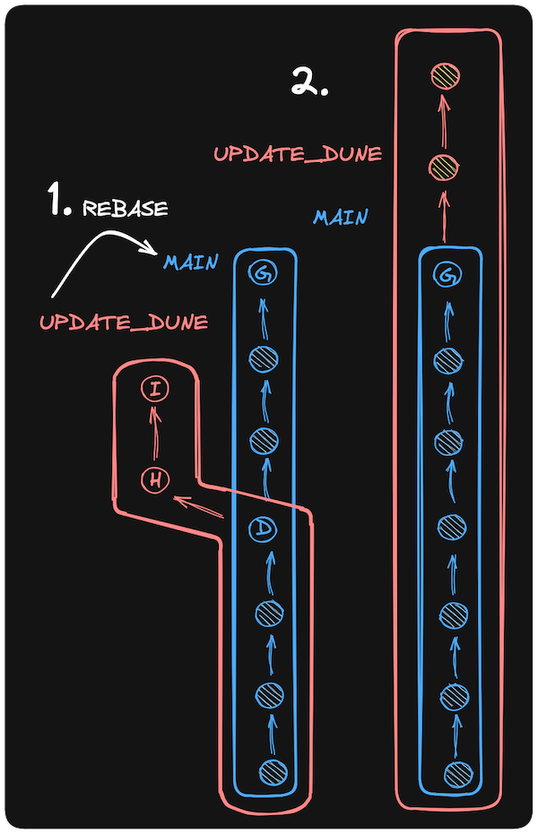

# Git

[Git](https://git-scm.com/) is *the* distributed [version control system](https://git-scm.com/book/en/v2/Getting-Started-About-Version-Control) (VCS). Nearly every developer in the world uses it to manage their code. It has quite a monopoly on VCS. Developers use Git to:

- Keep a history of their code changes
- Revert mistakes made in their code
- Collaborate with other developers
- Make backups of their code
- And much more

# Initial Configuratin

```bash
git config --get user.name
git config --get user.email
git config --add --global user.name "github_username_here"
git config --add --global user.email "email@example.com"
git config --global init.defaultBranch master
cat ~/.gitconfig
```

# Status

A file can be in one of [several states](https://git-scm.com/book/en/v2/Git-Basics-Recording-Changes-to-the-Repository#_the_very_basics) in a Git repository. Here are a few important ones:

- `untracked`: Not being tracked by Git
- `staged`: Marked for inclusion in the next commit
- `committed`: Saved to the repository's history

The `git status` command shows you the current state of your repo. It will tell you which files are untracked, staged, and committed.

# Staging

The `contents.md` file has been created, but as we saw, it's *untracked*. We need to stage it (add it to the "index") with the [git add](https://git-scm.com/docs/git-add) command before committing it later.

Without staging, every file in the repository would be included in every commit, but that's often not what you want.

Here's the command:

`git add <path-to-file | pattern>`

For example:

```bash
git add i-use-arch.btw
```

# **Commit**

After staging a file, we can [commit](https://docs.github.com/en/pull-requests/committing-changes-to-your-project/creating-and-editing-commits/about-commits) it.

A commit is a snapshot of the repository at a given point in time. It's a way to save the state of the repository, and it's how Git keeps track of changes to the project. A commit comes with a message that describes the changes made in the commit.

Here's how to [commit](https://git-scm.com/docs/git-commit) all of your staged files:

```bash
git commit -m "your message here"
```

# Git Log

A Git repo is a (potentially very long) list of commits, where each commit represents the *full state of the repository* at a given point in time.

The [git log](https://git-scm.com/docs/git-log) command shows a history of the commits in a repository. This is what makes Git a version control system. You can see:

- Who made a commit
- When the commit was made
- What was changed

## A commit hash

Each commit has a unique identifier called a "commit hash". This is a long string of characters that uniquely identifies the commit. Here's an example of mine:

```bash
5ba786fcc93e8092831c01e71444b9baa2228a4f
```

For convenience, you can refer to any commit or change within Git by using the first `7` characters of its hash. For mine, that's `5ba786f`.


**Git uses a cryptographic hash function called [SHA-1](https://en.wikipedia.org/wiki/SHA-1) to generate commit hashes.**


# Git Object File

All the data in a Git repository is stored directly in the (hidden) `.git` directory. That includes all the commits, branches, tags, and other objects we'll learn about later.

Git is made up of [objects](https://git-scm.com/book/en/v2/Git-Internals-Git-Objects) that are stored in the `.git/objects` directory. A commit is just a type of object.

Within .git/objects should be a folder that contains the first two characters of your commit hash

```bash
5ba786fcc93e8092831c01e71444b9baa2228a4f #folder called 5b
```

Within that folder is the file with the title generated as the remaining value of the hash

```bash
cat .git/objects/5b/a786fcc93e8092831c01e71444b9baa2228a4f 
# the above will be  a mess. The contents have been compressed to raw bytes

xxd .git/objects/5b/a786fcc93e8092831c01e71444b9baa2228a4f 
# the xxd command will print the contents of the file in hexadecimal forma
```

# Cat File

Luckily, Git has a built-in plumbing command, [cat-file](https://git-scm.com/docs/git-cat-file), that allows us to see the contents of a commit without needing to futz around with the object files directly.

# Trees and Blobs

- `tree`: git's way of storing a directory
- `blob`: git's way of storing a file

```bash
> git cat-file -p 5ba786fcc93e8092831c01e71444b9baa2228a4f

tree 4e507fdc6d9044ccd8a4a3061324c9f711c4667d
author ThePrimeagen <the.primeagen@aol.com> 1705891256 -0700
committer ThePrimeagen <the.primeagen@aol.com> 1705891256 -0700

A: add contents.md
```

Notice that we can see:

- The `tree` object
- The `author`
- The `committer`
- The commit message

However, we *cannot* see the contents of the `contents.md` file itself! That's because the `blob` object stores it.

## Blob

We can take the tree hash from the previous output and run git cat-file again:

```bash
git cat-file -p 4e507fdc6d9044ccd8a4a3061324c9f711c4667d
# Notice this is the value of the tree 

# Below is a sample output
100644 blob 63778e7169985c41e0c0d9c9b842346594f81ce9    contents.md
```

Again, we can then take the blob hash and put that back through git cat-file to see the contents of our [contents.md](http://contents.md) file

```bash
git cat-file -p 63778e7169985c41e0c0d9c9b842346594f81ce9

# In this example, the markdown file contains a sinel line
## contents
```

# Storing Data

Git stores an entire *snapshot* of files on a *per-commit* level. While it's true that Git stores entire snapshots, it *does* have some performance optimizations so that your `.git` directory doesn't get too unbearably large.

- Git [compresses and packs](https://git-scm.com/book/en/v2/Git-Internals-Packfiles) files to store them more efficiently.
- Git deduplicates files that are the same across different commits. If a file doesn't change between commits, Git will only store it once.

# Git Config

Git stores author information so that when you're making a commit it can track *who* made the change. Here's how you might update your global [Git configuration](https://git-scm.com/docs/git-config) (don't do this yet):

```bash
git config --add --global user.name "ThePrimeagen"
git config --add --global user.email "the.primeagen@aol.com"
```

Let's take the command apart:

- `git config`: The command to interact with your Git configuration.
- `-add`: Flag stating you want to *add* a configuration.
- `-global`: Flag stating you want this configuration to be stored globally in your `~/.gitconfig`. The opposite is "local", which stores the configuration in the current repository only.
- `user`: The section.
- `name`: The key within the section.
- `"ThePrimeagen"`: The value you want to set for the key.

The `--get` flag is useful for getting a single value.

## Get, Unset and Unset All

```bash
git config --get <key>
```

The `--unset` flag is used to remove a configuration value. For example:

```bash
git config --unset <key>
```

Typically, in a key/value store, like a [Python dictionary](https://docs.python.org/3/tutorial/datastructures.html#dictionaries), you aren't allowed to have duplicate keys. Strangely enough, Git doesn't care.

The `--unset-all` flag is useful if you ever *really* want to purge all instances of a key from your configuration. Conversely, the `--unset` flag only works with a single instance of a key.

```bash
git config --unset-all example.key
```

While we *can* store any key/value pairs we want in our Git configuration, that doesn't mean we *should*.

The `--remove-section` flag is used to remove an entire section from your Git configuration. For example:

```bash
git config --remove-section section
```

## Git Config Locations

There are several locations where Git can be configured. From more general to more specific, they are:

- **system**: `/etc/gitconfig`, a file that configures Git for all users on the system
- **global**: `~/.gitconfig`, a file that configures Git for all projects of a user
- **local**: `.git/config`, a file that configures Git for a specific project
- **worktree**: `.git/config.worktree`, a file that configures Git for part of a project

In my experience, 90% of the time you will be using `--global` to set things like your username and email. The other 9% of the time you will be using `--local` to set project-specific configurations. The last 1% of the time you *might* need to futz with system and worktree configurations, but it's extremely rare.

## Overriding

If you set a configuration in a more specific location, it will override the same configuration in a more general location. For example, if you set `user.name` in the local configuration, it will override the `user.name` set in the global configuration.



# Branches

A [Git branch](https://git-scm.com/book/en/v2/Git-Branching-Branches-in-a-Nutshell) allows you to keep track of different changes separately.

For example, let's say you have a big web project and you want to experiment with changing the color scheme. Instead of changing the entire project directly (as of right now, our `master` branch), you can create a new branch called `color_scheme` and work on that branch. When you're done, if you like the changes, you can [merge](https://git-scm.com/book/en/v2/Git-Branching-Basic-Branching-and-Merging) the `color_scheme` branch back into the `master` branch to keep the changes. If you don't like the changes, you can simply delete the `color_scheme` branch and go back to the `master` branch.

A branch is just a named [pointer](https://en.wikipedia.org/wiki/Pointer_(computer_programming)#:~:text=A%20pointer%20is%20a%20programming,than%20storing%20the%20data%20itself.) to a specific commit. When you create a branch, you are creating a new pointer to a specific commit. The commit that the branch points to is called the tip of the branch.



Because a branch is just a pointer to a commit, they're lightweight and "cheap" resource-wise to create. When you create 10 branches, you're not creating 10 copies of your project on your hard drive.

Check which branch you're currently on by running:

```bash
git branch
```

## Default Branch

We've been using [Git's](https://git-scm.com/) default `master` branch. Interestingly, [GitHub](https://github.com/) (a website where you can remotely store Git projects) recently changed its default branch from `master` to `main`. As a general rule, I recommend using `main` as your default branch if you work primarily with `GitHub`, as we will.

To rename a branch:

```bash
git branch -m oldname newname
```

## Creating a New Branch

```bash
git branch my_new_branch
```

This creates a new branch called `my_new_branch`. The thing is, I rarely use this command because usually I want to create a branch and switch to it immediately. So I use this command instead:

```bash
git switch -c my_new_branch
```

The [switch](https://git-scm.com/docs/git-switch) command allows you to switch branches, and the `-c` flag tells Git to create a new branch if it doesn't already exist.

```bash
git switch prime

# or, the old way:
git checkout prime
```

Both methods above allow you to switch between branches. `git switch` is a newer command that is meant to be more intuitive and user-friendly. It's recommended to use `git switch` over `git checkout` for simply switching branches.

## Branch from a certain commit

```bash
git switch -c update_dune COMMITHASH
```

# Merge

Once you're happy with your changes, you'll want to [merge](https://git-scm.com/docs/git-merge) them back into the main branch so that they make their way into the final product.

Let's say you're in a state where you have two branches, each with their own unique commits:

```bash
A - B - C    main
   \
    D - E    other_branch
```

f you merge `other_branch` into `main`, Git combines both branches by creating a new commit that has *both* histories as parents. In the diagram below, `F` is a [merge commit](https://git-scm.com/docs/git-merge#_true_merge) that has `C` and `E` as parents. `F` brings all the changes from `D` and `E` back into the `main` branch.

```bash
A - B - C - F    main
   \     /
    D - E        other_branch
```

Let's say we start with this:

```bash
A - B - C    main
   \
    D - E    vimchadsonly
```

And we merge `vimchadsonly` into `main` by running this while on `main`:

```bash
git merge vimchadsonly
```

The merge will:

1. Find the "merge base" commit, or "best common ancestor" of the two branches. In this case, `A`.
2. Replays the changes from `main`, starting from the best common ancestor, into a new commit.
3. Replays the changes from `vimchadsonly` onto `main`, starting from the best common ancestor.
4. Records the result as a new commit, in our case, `F`.
5. `F` is special because it has *two parents*, `C` and `E`.

## Merge Log

Your output from `git log --oneline --decorate --graph --parents` (aside from the hashes) should could *something* like:

```bash
*   89629a9 d234104 b8dfd64 (HEAD -> main) F: Merge branch 'add_classics'
|\
| * b8dfd64 fba0999 (tag: 5.8, add_classics) D: add classics
* | d234104 fba0999 (tag: 6.1) E: update contents
|/
* fba0999 1381199 (tag: 3.8, origin/master, origin/main, master) C: add quotes
* 1381199 a21228f (tag: 3.7) B: add titles.md
* a21228f A: add contents.md
```

Each asterisk `*` represents a commit in the repository. There are multiple commit hashes on each line because the `--parents` flag logs the parent hash(es) as well.

- The first line, with these three hashes: `89629a9 d234104 b8dfd64` is our recent merge commit. The first hash, `89629a9` is the merge commit's hash, and the other two are the parent commits.
- The next section is a visual representation of the branch structure. It shows the commits on the `add_classics` branch and the `main` branch before the merge. Notice that they both share a common parent.
- The next three lines are just "normal" commits, each pointing to their parent.
- The last line is the initial commit and therefore has no parent.

## **Fast Forward Merge**

The simplest type of merge is a [fast-forward merge](https://git-scm.com/docs/git-merge#_fast_forward_merge). Let's say we start with this:

```bash
      C     delete_vscode
     /
A - B       main
```

And we run this while on `main`:

```bash
git merge delete_vscode
```

Because `delete_vscode` has *all the commits* that `main` has, Git automatically does a fast-forward merge. It just moves the pointer of the "base" branch to the tip of the "feature" branch:

```bash
            delete_vscode
A - B - C   main
```

Notice that with a fast-forward merge, **no [merge commit](https://git-scm.com/docs/git-merge#_true_merge) is created**.

This is a common workflow when working with Git on a team of developers:

1. Create a branch for a new change
2. Make the change
3. Merge the branch back into `main` (or whatever branch your team dubs the "default" branch)
4. Remove the branch
5. Repeat

# Rebase

"[Rebase](https://git-scm.com/docs/git-rebase) vs [Merge](https://git-scm.com/docs/git-merge)" is one of the most hotly debated topics in the Git world. A lot of the discussions you'll see online come down to the fact that many developers (yes, even professionals) don't understand the purpose of rebase and use it incorrectly, causing a bunch of Git havoc, and then blame the rebase command.

*It's not Git's fault, it's a skill issue.*

Say we have this commit history:

```bash
A - B - C    main
   \
    D - E    feature_branch
```

We're working on `feature_branch`, and want to bring in the changes our team added to `main` so we're not working with a stale branch. We could merge `main` into `feature_branch`, but that would create an additional merge commit. Rebase avoids a merge commit by replaying the commits from `feature_branch` on top of `main`. After a rebase, the history will look like this:

```bash
A - B - C         main
         \
          D - E   feature_branch
```

To use [rebase](https://git-scm.com/docs/git-rebase) to bring changes from `main` onto a current branch (let's pretend we're on one called `jdsl`), we would run this while on the `jdsl` branch:

```bash
git rebase main
```



## When to Rebase

[git rebase](https://git-scm.com/docs/git-rebase) and [git merge](https://git-scm.com/docs/git-merge) are different tools.

An advantage of merge is that it preserves the true history of the project. It shows when branches were merged and where. One disadvantage is that it can create a lot of merge commits, which can make the history harder to read and understand.

A linear history is generally easier to read, understand, and work with. Some teams enforce the usage of one or the other on their `main` branch, but generally speaking, you'll be able to do whatever you want with your own branches.


**You should *never* rebase a public branch (like `main`) onto anything else. Other developers have it checked out, and if you change its history, you'll cause a lot of problems for them.**

However, with your own branch, you can rebase onto other branches (including a public branch like `main`) as much as you want.**

</aside>

# Git Reset Soft

The [git reset](https://git-scm.com/docs/git-reset) command can be used to undo the last commit(s) or any changes in the index (staged but not committed changes) and the worktree (unstaged and not committed changes).

```bash
git reset --soft COMMITHASH
```

The `--soft` option is useful if you just want to go back to a previous commit, but keep all of your changes. Committed changes will be uncommitted and staged, while uncommitted changes will remain staged or unstaged as before.

# **Git Reset Hard**

In the last lesson, we undid a commit but kept the changes. We don't want to keep the changes to `titles.md`, here's how to reset those changes.

```bash
git reset --hard COMMITHASH
```

This is useful if you just want to go back to a previous commit and discard all the changes.

## Danger

I want to stress how **dangerous** this command can be. If you were to simply delete a *committed* file, it would be trivially easy to recover because it is tracked in Git. However, if you used `git reset --hard` to undo committing that file, it would be deleted for good.

Always be careful when using `git reset --hard`. It's a powerful tool, but it's also a dangerous one.

# Git Remote

Often our frenemies (read: coworkers) make code changes that we need to begrudgingly accept into our pristine bug-free repos. */s*

This is where the "distributed" in "distributed version control system" comes from. We can have "remotes", which are just external repos with *mostly* the same Git history as our local repo.

When it comes to Git (the CLI tool), there really isn't a "central" repo. GitHub is just someone else's repo. Only by convention and convenience have we, as developers, started to use GitHub as a "source of truth" for our code.

In git, another repo is called a "remote." The standard convention is that when you're treating the remote as the "authoritative source of truth" (such as GitHub) you would name it the "origin".

By "authoritative source of truth" we mean that it's the one you and your team treat as the "true" repo. It's the one that contains the most up-to-date version of the accepted code.

```bash
git remote add <name> <uri>
```

## Fetch

Adding a remote to our Git repo does *not* mean that we automagically have all the contents of the remote. First, we need to [fetch](https://git-scm.com/docs/git-fetch) the contents (but not yet!).

```bash
git fetch
```

This downloads copies of all the contents of the `.git/objects` directory (and other book-keeping information) from the remote repository into your current one.

Just because we fetched all of the metadata from the remote `webflyx` repo doesn't mean we have all of the files.

## Merge

Just as we merged branches within a single local repo, we can also merge branches between local and remote repos.

```bash
git merge remote/branch
```

For example, if you wanted to merge the `primeagen` branch of the remote `origin` into your local `main` branch, you would run this inside the local repo while on the `main` branch:

```bash
git merge origin/primeagen
```

# Installing GitHub on Linux to Authenticate

```bash
curl -sS https://webi.sh/gh | sh
```

Then to make sure you are authenticated run:

```bash
gh auth login
```

This should be a guided process

# Git Push

The `git push` command pushes (sends) local changes to any "remote" - in our case, GitHub. For example, to push our local `main` branch's commits to the remote `origin`'s `main` branch we would run:

```bash
git push origin main
```

You can also push a local branch to a remote with a *different* name:

```bash
git push origin <localbranch>:<remotebranch>
```

*It's less common to do this, but nice to know.*

You can also *delete* a remote branch by pushing an empty branch to it:

```bash
git push origin :<remotebranch>
```

# Git Pull

Fetching is nice, but most of the time we want the *actual file changes* from a remote repo, not just the metadata.

`git pull [<remote>/<branch>]`

*The `[...]` syntax means that the bracketed remote and branch are optional. If you execute git pull without anything specified it will pull your current branch from the remote repo*.

# **Pull Requests**

On GitHub, a [pull request](https://docs.github.com/en/github/collaborating-with-issues-and-pull-requests/about-pull-requests) is a way to propose changes, typically to the rest of your team, or to the maintainer of a project you're contributing to.

Pull requests allow team members to see what changes are being 
proposed and to discuss them before they are merged into the main 
codebase.

# Primeagen Workflow

While on the topic of pull requests, I want to share a note on my 
simple workflow. 90% of the time, you're only using a handful of git 
commands to get your coding work done.

## Keep stuff on GitHub

I keep all my serious projects on GitHub. That way if my computer 
explodes, I have a backup, and if I'm ever on another computer, I can 
just clone the repo and get back to work.

## Rebase vs Merge

I've configured Git to rebase by default on pull, rather than merge 
so I keep a linear history. If you want to do the same, you can add this
 to your global Git config:

```jsx
git config --global pull.rebase true
```

## Solo Workflow

When I'm working by myself, I usually stick to a single branch, `main`.
 I mostly use Git on solo projects to keep a backup remotely and to keep
 a history of my changes. I only rarely use separate branches.

1. Make changes to files
2. `git add .` (or `git add <files>` if I only want to add specific files)
3. `git commit -m "a message describing the changes"`
4. `git push origin main`

It really is that simple for most solo work. `git log`, `git reset`, and some others are, of course, useful from time to time, but the above is the core of what I do day-to-day.

## Team Workflow

When you're working with a *team*, Git gets a bit more involved (and we'll cover more of this in part 2 of this course). Here's what I do:

- Update my local `main` branch with `git pull origin main`
- Checkout a new branch for the changes I want to make with `git switch -c <branchname>`
- Make changes to files
- `git add .`
- `git commit -m "a message describing the changes"`
- `git push origin <branchname>` (I push to the *new* branch name, not `main`)
- Open a [pull request](https://docs.github.com/en/github/collaborating-with-issues-and-pull-requests/about-pull-requests) on GitHub to merge my changes into `main`
- Ask a team member to review my pull request
- Once approved, click the "Merge" button on GitHub to merge my changes into `main`
- Delete my feature branch, and repeat with a new branch for the next set of changes

# Merge Pull Request

In a typical team workflow, you would ask a team mate to review your pull request. If they approve of the changes, they would approve the pull request, and you'd be clear to merge.

# Git Ignore

As you've seen, it's *pretty normal* to use the following workflow from the top level of your repo:

1. `git add .`
2. `git commit -m "some message here"`
3. `git push origin main`

A problem arises when we want to put files in our project's directory, but we *don't* want to track them with Git. **A [`.gitignore`](https://git-scm.com/docs/gitignore) file solves this.** For example, if you work with Python, you probably want to ignore automatically generated files like `.pyc` and `__pycache__`. If you are building a server, you probably want to ignore `.env` files that might hold private keys. If you (I'm sorry) work with JavaScript, you might want to ignore the `node_modules` directory.


Here's an example `.gitignore` file, which exists at the root of a repo:

```jsx
node_modules
```

This will ignore every path containing `node_modules` as a "section" (directory name or file name). It ignores:

- `node_modules/code.js`
- `src/node_modules/code.js`
- `src/node_modules`

It does *not* ignore:

- `src/node_modules_2/code.js`
- `env/node_modules_3`

Your `.gitignore` file does *not* necessarily need to be at the root of your project.

It's fairly common to have multiple `.gitignore` files in different directories throughout a project. A nested `.gitignore` file only applies to the directory it's in and its subdirectories.

Let's say you have the following setup:

```jsx
src/
├── assets/
│   ├── .gitignore
|   ├── cover_art.jpg
│   └── onlydevs.png
├── main.py
├── tests.py
├── venv/
│   └── bin/
|       ├── activate
│       └── python
.gitignore
```

Here's the contents of `src/assets/.gitignore`:

```jsx
onlydevs.png
main.py
```

Here's the contents of the root `.gitignore`:

```jsx
venv/bin/activate
```

## Patterns

It would be *rough* if `.gitignore` files only accepted exact filepath section names. Luckily, they don't!

Let's go over some of the most common patterns

### Wildcards

The `*` character matches any number of characters except for a slash (`/`). For example, to ignore *all* `.txt` files, you could use the following pattern:

```jsx
*.txt
```

### Rooted Patterns

Patterns starting with a `/` are anchored to the directory containing the `.gitignore` file. For example, this would ignore a `main.py` in the root directory, but not in any subdirectories:

```jsx
/main.py
```

### Negation

You can negate a pattern by prefixing it with an exclamation mark (`!`). For example, to ignore all `.txt` files *except* for `important.txt`, you could use the following pattern:

```jsx
*.txt
!important.txt
```

### Comments

You can add comments to your `.gitignore` file by starting a line with a `#`. For example:

```jsx
# Ignore all .txt files
*.txt
```

### Order Matters

The order of patterns in a `.gitignore` file determines their effect, and patterns can override each other. For example:

```jsx
temp/
!temp/instructions.md
```

Everything in the `temp/` directory would be ignored *except* for `instructions.md`. If the order were reversed, `instructions.md` would be ignored.

## What to Ignore?

We've talked about *how* to ignore files, but the deeper question is *what* should you ignore? Here are some rules of thumb for coding projects:

1. Ignore things that can be *generated* (e.g. compiled code, minified files, etc.)
2. Ignore dependencies (e.g. `node_modules`, `venv`, `packages`, etc.)
3. Ignore things that are personal or specific to how you like to work (e.g. editor settings)
4. Ignore things that are sensitive or dangerous (e.g. `.env` files, passwords, API keys, etc.)