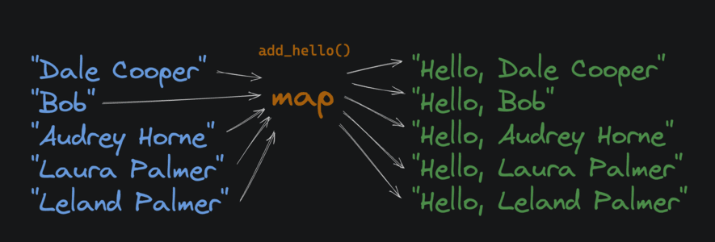
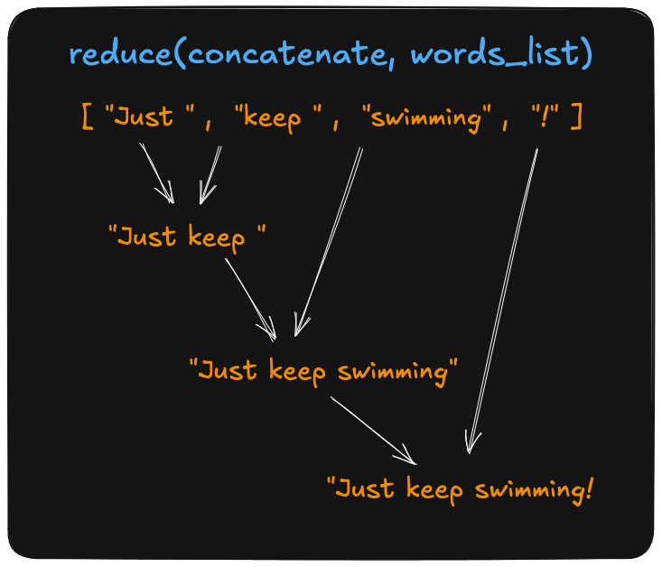

# Functional Programming

Functional programming is a style (or "paradigm" if you're pretentious) of programming where we compose functions instead of mutating state (updating the value of variables).

- [Functional programming](https://en.wikipedia.org/wiki/Functional_programming) is more about declaring *what* you want to happen, rather than *how* you want it to happen.
- [Imperative](https://en.wikipedia.org/wiki/Imperative_programming) (or procedural) programming declares both the *what* and the *how*.

**Example of imperative code:**

```python
car = create_car()
car.add_gas(10)
car.clean_windows()
```

**Example of functional code:**

```python
return clean_windows(add_gas(create_car()))
```

The important distinction is that in the functional example, we never change the value of the `car` variable, we just compose functions that return new values, with the outermost function, `clean_windows` in this case, returning the final result.


# **Python and Functional Programming**

Frankly, Python is *not* the best language for functional programming. Reasons include:

1. No [static typing](https://developer.mozilla.org/en-US/docs/Glossary/Static_typing).
2. (Almost) everything is [mutable](https://en.wikipedia.org/wiki/Immutable_object).
3. No [tail call optimization](https://exploringjs.com/es6/ch_tail-calls.html).
4. [Side effects](https://en.wikipedia.org/wiki/Side_effect_(computer_science)) are common.
5. Imperative and OOP styles abound in popular libraries.
6. [Purity](https://en.wikipedia.org/wiki/Pure_function) is not enforced (and sometimes not even encouraged).
7. [Sum Types](https://en.wikipedia.org/wiki/Algebraic_data_type) are hard to define.
8. [Pattern matching](https://en.wikipedia.org/wiki/Pattern_matching) is weak at best.

Functional programming is a paradigm of useful techniques for writing better code, and they apply to all languages, not just purely functional ones.

Some popular functional coding languages are:

- [Haskell](https://www.haskell.org/)
- [OCaml](https://ocaml.org/)
- [Elixir](https://elixir-lang.org/)

# **Immutability**

In FP, we strive to make data [*immutable*](https://en.wikipedia.org/wiki/Immutable_object). Once a value is created, it cannot be changed. *Mutable* data, on the other hand, can be changed after it's created.

## Who Cares

Immutable data is easier to think about and work with. When 10 different functions have access to the same variable, and you're debugging a problem with that variable, you have to consider the possibility that any of those functions could have changed the value.

When a variable is immutable, you can be sure that it hasn't changed since it was created. It's a helluva lot easier to work with.

*Generally speaking, immutability means fewer bugs and more maintainable code.*

## Tuples vs. Lists

Tuples and lists are both ordered collections of values, but tuples are *immutable* and lists are *mutable*.

You can append to a list, but you can *not* append to a tuple. You can create a *new copy* of a tuple using values from an existing tuple, but you can't change the existing tuple.

### **Lists Are Mutable**

```python
ages = [16, 21, 30]
# 'ages' is being changed in place
ages.append(80)
# [16, 21, 30, 80]
```

### **Tuples Are Immutable**

```python
ages = (16, 21, 30)
more_ages = (80,) # note the comma! It's required for a single-element tuple
# 'all_ages' is a brand new tuple
all_ages = ages + more_ages
# (16, 21, 30, 80)
```

# **Declarative Programming**

Functional programming aims to be *declarative*. We prefer to declare *what* we want the computer to do, rather than muck around with the details of *how* to do it.

Let's take an extreme example and pretend we wanted to style a webpage with [CSS](https://developer.mozilla.org/en-US/docs/Web/CSS) (Obviously a hypothetical because, well, why would anyone want to work on the frontend???)

## **Declarative Styling**

The following CSS changes all [button](https://developer.mozilla.org/en-US/docs/Web/HTML/Element/button) elements to have red text:

```css
button {
    color: red;
}
```

It does *not* execute line-by-line like an imperative language. Instead, it simply declares the desired style, and it's up to a web browser to figure out how to apply and display it.

## **Imperative Styling**

Unlike functional programming (and CSS), a lot of code is *imperative*. We write out the exact step-by-step implementation details. This Python script draws a red button on a screen using the [Tkinter](https://docs.python.org/3/library/tkinter.html) library:

```css
from tkinter import * # first, import the library
master = Tk() # create a window
master.geometry("200x100") # set the window size
button = Button(master, text="Submit", fg="red").pack() # create a button
master.mainloop() # start the event loop
```

# It’s Math

Functional programming tends to be popular amongst developers with a strong mathematical background. After all, a math equation isn't procedural: it's declarative. Take the following math equation:

```python
avg = Σx/N
```

To put this calculation in plain English:

1. `Σ` is just the Greek letter [Sigma](https://en.wikipedia.org/wiki/Sigma), and it represents "the [sum](https://en.wikipedia.org/wiki/Summation) of a collection".
2. `x` is the collection of numbers we're averaging.
3. `N` is the number of elements in the collection.
4. `avg` is equal to the sum of all the numbers in collection "x" divided by the number of elements in collection "x".

So, the equation really just says that `avg` is the average of all the numbers in collection "x". This math equation is a *declarative* way of writing "calculate the average of a list of numbers". Here's some *imperative Python code* that does the same thing:

```python
def get_average(nums):
    total = 0
    for num in nums:
        total += num
    return total / len(nums)
```

However, with functional programming, we would write code that's *a bit more* declarative:

```python
def get_average(nums):
    return sum(nums) / len(nums)
```

Here we're not keeping track of state (the `total` variable in the first example is ["stateful"](https://en.wikipedia.org/wiki/State_(computer_science)#:~:text=In%20information%20technology%20and%20computer,known%20as%20its%20state%20space.)). We're simply composing functions together to get the result we want.

# **Classes vs. Functions**

I run into new developers who, after learning about classes, want to use them *everywhere*. They assume that because they learned about functions first, functions are somehow inferior.

**Nope.** They're just different.

## **Should I Use Functions or Classes?**

Here's my rule of thumb:

**If you're unsure, default to functions.** I find myself reaching for classes when I need something long-lived and stateful that would be easier to model if I could share behavior *and data structure* via inheritance. This is often the case for:

- Video games
- Simulations
- GUIs

The difference is:

>Classes encourage you to think about the world as a hierarchical collection of objects. Objects bundle behavior, data, and state together in a way that draws boundaries between instances of things, like chess pieces on a board.

>Functions encourage you to think about the world as a series of data transformations. Functions take data as input and return a transformed output. For example, a function might take the entire state of a chess board and a move as inputs, and return the new state of the board as output.

</aside>

# **Debugging FP**

It's *nearly impossible*, even for tenured senior developers, to write perfect code the first time. That's why debugging is such an important skill. The trouble is, sometimes you have these "elegant" (sarcasm intended) one-liners that are tricky to debug:

```python
def get_player_position(position, velocity, friction, gravity):
    return calc_gravity(calc_friction(calc_move(position, velocity), friction), gravity)
```

If the output of `get_player_position` is incorrect, it's hard to know what's going on inside that black box. *Break it up!* Then you can inspect the `moved`, `slowed`, and `final` variables more easily:

```python
def get_player_position(position, velocity, friction, gravity):
    moved = calc_move(position, velocity)
    slowed = calc_friction(moved, friction)
    final = calc_gravity(slowed, gravity)
    print("Given:")
    print(f"position: {position}, velocity: {velocity}, friction: {friction}, gravity: {gravity}")
    print("Results:")
    print(f"moved: {moved}, slowed: {slowed}, final: {final}")
    return final
```

Once you've run it, found the issue, and solved it, you can remove the `print` statements.

# **Functional vs. OOP**

Functional programming and object-oriented programming are **styles for writing code**. One isn't inherently superior to the other, but to be a well-rounded developer you should understand both well and use ideas from each when appropriate.

You'll encounter developers who love functional programming and others who love object-oriented programming. However, contrary to popular opinion, FP and OOP are *not* always at odds with one another. They aren't opposites. Of the four pillars of OOP, [inheritance](https://en.wikipedia.org/wiki/Inheritance_(object-oriented_programming)) is the only one that doesn't fit with functional programming.


Inheritance isn't seen in functional code due to the mutable classes that come along with it. Encapsulation, polymorphism and abstraction are still used all the time in functional programming.

When working in a language that supports ideas from both FP and OOP (like Python, JavaScript, or Go) the best developers are the ones who can use the best ideas from both paradigms effectively and appropriately.

# **Functions As Values**

In Python, functions are just values, like strings, integers, or objects. For example, we can assign an existing function to a variable:

```python
def add(x, y):
    return x + y

# assign the function to a new variable
# called "addition". It behaves the same
# as the original "add" function
addition = add
print(addition(2, 5))
# 7
```

# **Anonymous Functions**

Anonymous functions have *no name*, and in Python, they're called [lambda functions](https://docs.python.org/3/reference/expressions.html#lambda) after [lambda calculus](https://en.wikipedia.org/wiki/Lambda_calculus). Here's a lambda function that takes a single argument `x` and returns the result of `x + 1`:

```python
lambda x: x + 1
```

Notice that the [expression](https://docs.python.org/3/reference/expressions.html#expressions) `x + 1` is returned *automatically*, no need for a `return` statement. And because functions are just values, we can assign the function to a variable named `add_one`:

```python
add_one = lambda x: x + 1
print(add_one(2))
# 3
```

Lambda functions might *look* scary, but they're still just functions. Because they simply return the result of an expression, they're often used for small, simple evaluations. Here's an example that uses a lambda to get a value from a dictionary:

```python
get_age = lambda name: {
    "lane": 29,
    "hunter": 69,
    "allan": 17
}.get(name, "not found")
print(get_age("lane"))
# 29
```

# **First Class and Higher Order Functions**

A programming language "supports first-class functions" when functions are treated like any other variable. That means functions can be passed as arguments to other functions, can be returned by other functions, and can be assigned to variables.

- **First-class function:** A function that is treated like any other value
- **Higher-order function:** A function that accepts another function as an argument or returns a function

Python supports first-class and higher-order functions.

## First Class Example

```python
def square(x):
    return x * x

# Assign function to a variable
f = square

print(f(5))
# 25
```

## Higher Order Example

```python
def square(x):
    return x * x

def my_map(func, arg_list):
    result = []
    for i in arg_list:
        result.append(func(i))
    return result

squares = my_map(square, [1, 2, 3, 4, 5])
print(squares)
# [1, 4, 9, 16, 25]
```

# **Map**

"Map", "filter", and "reduce" are three commonly used [higher-order functions](https://en.wikipedia.org/wiki/Higher-order_function) in functional programming.

In Python, the built-in [map](https://docs.python.org/3/library/functions.html#map) function takes a function and an [iterable](https://docs.python.org/3/glossary.html#term-iterable) (in this case a list) as inputs. It returns an iterator that applies the function to every item, yielding the results.



With `map`, we can operate on lists without using loops and nasty stateful variables. For example:

```python
def square(x):
    return x * x

nums = [1, 2, 3, 4, 5]
squared_nums = map(square, nums)
print(list(squared_nums))
# [1, 4, 9, 16, 25]
```

*The [list type constructor](https://docs.python.org/3/library/stdtypes.html#list), `list()` converts the `map` object back into a standard list.*

# **Filter**

The built-in [filter](https://docs.python.org/3/library/functions.html#filter) function takes a function and an iterable (in this case a list) and returns a *new* iterable that only contains elements from the original iterable where the result of the function on that item returned `True`.


```python
def is_even(x):
    return x % 2 == 0

numbers = [1, 2, 3, 4, 5, 6]
evens = list(filter(is_even, numbers))
print(evens)
# [2, 4, 6]
```

# **Reduce**

The built-in [functools.reduce()](https://docs.python.org/3/library/functools.html#functools.reduce) function takes a function and a list of values, and applies the function to each value in the list, *accumulating a single result* as it goes.



```python
# import functools from the standard library
import functools

def add(sum_so_far, x):
    print(f"sum_so_far: {sum_so_far}, x: {x}")
    return sum_so_far + x

numbers = [1, 2, 3, 4]
sum = functools.reduce(add, numbers)
# sum_so_far: 1, x: 2
# sum_so_far: 3, x: 3
# sum_so_far: 6, x: 4
# 10 doesn't print, it's just the final result
print(sum)
# 10
```

# **Map, Filter, and Reduce Review**

Higher-order functions like `map`, `filter`, and `reduce`, allow us to avoid stateful iteration and mutations of variables.

Take a look at this [imperative](https://en.wikipedia.org/wiki/Imperative_programming) code that calculates the [factorial](https://en.wikipedia.org/wiki/Factorial) of a number:

```python
def factorial(n):
    # a procedure that continuously multiplies
    # the current result by the next number
    result = 1
    for i in range(1, n + 1):
        result *= i
    return result
```

Here's the same factorial function using `reduce`:

```python
import functools

def factorial(n):
    return functools.reduce(lambda x, y: x * y, range(1, n + 1))
```

In the functional example, we're just combining functions to get the result we want. There's no need to reassign variables or keep track of the program's state in a loop.

A loop is inherently stateful. Depending on which iteration you're on, the `i` variable has a different value.

# **Pure Functions**

If you take nothing else away from this course, *please* take this: [**Pure functions](https://en.wikipedia.org/wiki/Pure_function) are fantastic.** They have two properties:

- They *always* return the same value given the same arguments.
- Running them causes no side effects

In short: **pure functions don't do anything with anything that exists outside of their scope.**

## Example of a Pure Function

```python
def find_max(nums):
    max_val = float("-inf")
    for num in nums:
        if max_val < num:
            max_val = num
    return max_val
   
```

## Example of an Impure Function

```python
# instead of returning a value
# this function modifies a global variable
global_max = float("-inf")

def find_max(nums):
    global global_max
    for num in nums:
        if global_max < num:
            global_max = num
```
